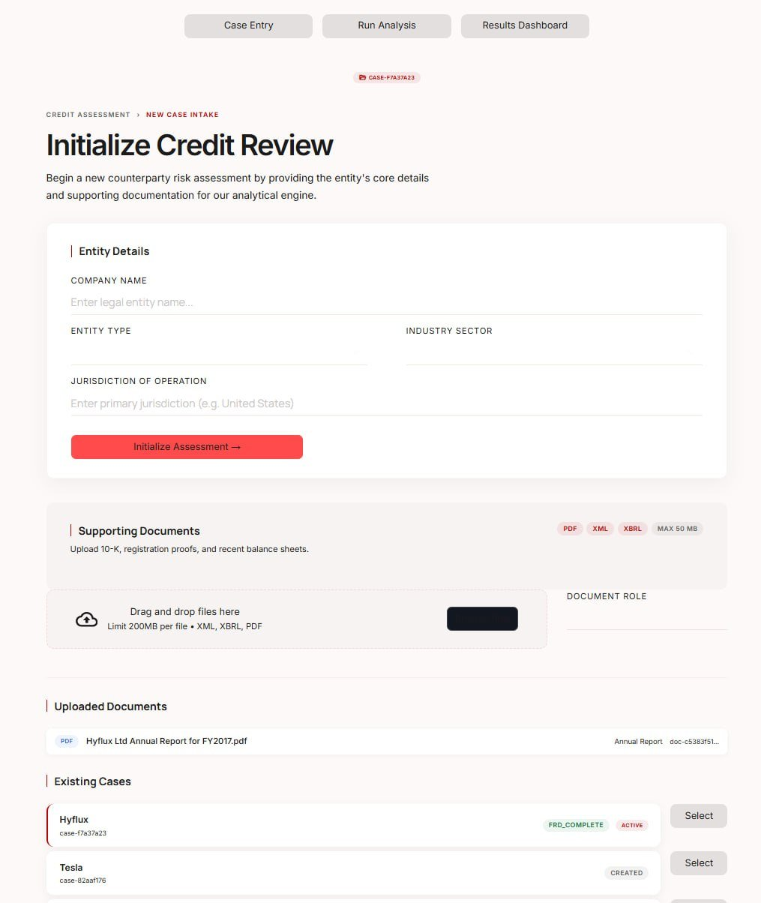
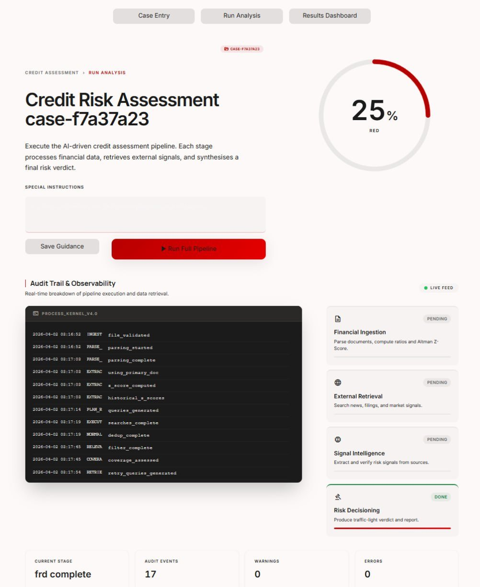

# CREWS: Credit Risk Early Warning System

CREWS reads a company's financial filings and public news and gives a credit analyst a Red / Amber / Green early warning, with the evidence behind it.

> Academic prototype built for UBS Singapore through an SMU industry collaboration. Not a UBS product. Uses only publicly available data.

<p align="center">
  
  
</p>
<p align="center"><em>Screenshots from the April 2026 demo. Colours have since changed.</em></p>

## What it produces

- **A Red / Amber / Green verdict** for each company case, with the 12-criteria scorecard that produced it.
- **Financial health from uploaded filings:** Altman Z-Score (variant chosen by industry and listing status), 14 financial ratios and a comparison with static industry benchmarks.
- **Credit risk signals** from news, web, filing, forum and social sources, each tied to a text snippet, with disputed or weakly supported signals flagged.
- **An analyst report** in 8 sections (downloadable as Markdown), a chat assistant for follow-up questions, and the full case result as JSON.

## How it works

Four LangGraph subgraphs, run in order:
- **FIS (Financial Ingestion):** an LLM parses uploaded PDF, XML or XBRL filings; ratios and the Z-Score are then computed deterministically.
- **RS (Retrieval):** an LLM plans searches across 8 default risk topics, Tavily runs them in parallel, and results are filtered for relevance. Under-covered topics get up to 2 retries.
- **SIS (Signal Sourcing):** an LLM extracts signals; they are validated, checked against the source text, and screened for contradictions across sources (embedding pre-filter, NLI model, LLM confirmation).
- **FRD (Fusion & Risk Decisioning):** fixed rules turn signals and financials into the verdict. Red needs 2+ high-weight criteria (or 3+ medium); a single high-weight criterion gives Amber. Positive signals with average confidence of at least 0.65 can lower Amber to Green, or Red to Amber when no more than 2 high-weight criteria are met. An LLM then writes the report, but the verdict always comes from the rules.

## Architecture

```
+---------------------------------------------------------------------+
|                            USER / ANALYST                           |
|                   (Streamlit frontend, port 8501)                   |
+---------------------------------------------------------------------+
                               | HTTP (REST)
                               v
+---------------------------------------------------------------------+
|                     FastAPI backend (port 8000)                     |
|                                                                     |
|  POST /api/cases                 create a case                      |
|  POST /api/cases/{id}/documents  upload PDF / XML / XBRL            |
|  POST /api/cases/{id}/run-all    run the full pipeline              |
|  GET  /api/cases/{id}/status     poll progress                      |
|  GET  /api/cases/{id}/result     fetch results                      |
|  POST /api/cases/{id}/chat       ask the analyst assistant          |
|                                                                     |
|  Background task: graph_runner.run_full_pipeline()                  |
|                                                                     |
|  +-------+    +------+    +-------+    +-------+                    |
|  |  FIS  |--->|  RS  |--->|  SIS  |--->|  FRD  |                    |
|  +-------+    +------+    +-------+    +-------+                    |
|      |            |            |            |                       |
|      +----- SQLite (CaseState as JSON) -----+                       |
+---------------------------------------------------------------------+
                               |
                               v
                    OpenRouter (default: google/gemini-2.5-flash)
                    LLM calls from all four stages and the chat
```

Details: [docs/ARCHITECTURE.md](docs/ARCHITECTURE.md) (every node, threshold and state schema) and [WORKFLOW_DIAGRAM.md](WORKFLOW_DIAGRAM.md) (node-level diagrams).

## Key design decisions

- **Deterministic verdict, LLM narrative.** The traffic light comes from fixed rules, so it is reproducible and can be re-scored with different thresholds without calling a model.
- **Recency as a score, not a cutoff.** Older sources are down-weighted rather than dropped, so an old lawsuit that still matters is kept.
- **Model choice is configuration.** All LLM calls go through one OpenRouter client, and each stage's model can be changed with an environment variable.

## Evaluation

> The test set is **4 synthetic documents about one company** (Hyflux, 2018), written for this project ([details](data/local/hyflux/README.md)). These results show the pipeline works end to end; they do not show that it generalises.

**Extraction model comparison** on the same 4 documents ("key events" are the 4 events the documents were written to contain):

| Model | Signals | Key events found | Cost | Latency / doc |
|---|---|---|---|---|
| gemini-2.5-flash (default) | 33 | 4 / 4 | $0.0072 | 3.6 s |
| gpt-4o-mini | 16 | 4 / 4 | $0.0012 | 5.5 s |
| claude-3.5-haiku | 13 | 3 / 4 | $0.0065 | 4.2 s |

**Scoring boundary test:** all 128 combinations of the seven signal-based risk criteria were scored (32 Red, 89 Amber, 7 Green), and 12 of 12 scenario checks give the expected traffic light. Reproduce with `python -m tests.scoring_boundary_test` (no API key) and `python -m tests.model_comparison` (needs an API key and makes paid calls).

During the project the full pipeline was also run live on four real companies: Hyflux (RED in all 3 runs), Hin Leong Trading (RED), Tesla (AMBER) and DBS Bank (GREEN on public signals alone; AMBER in a run that also included its financial statements, where the Z-Score could not be computed). The Hin Leong and GREEN DBS verdicts came from public signals alone, with no financial statements. Data from those runs is not included in this repository.

## Tech stack

Python 3.11+ · LangGraph · FastAPI · Streamlit · SQLite (SQLAlchemy) · Pydantic · OpenRouter · Tavily · PyMuPDF · sentence-transformers

## Quickstart

```bash
git clone https://github.com/haoyue-smu/crews-credit-risk-early-warning.git
cd crews-credit-risk-early-warning
python -m venv .venv
.venv/bin/pip install -r requirements.txt     # Windows: .venv\Scripts\pip install -r requirements.txt
cp .env.example .env                          # add OPENROUTER_API_KEY and TAVILY_API_KEY
./start.sh                                    # Windows: start.bat
```

Open http://localhost:8501, create a case and upload [`samples/dummy_financials.xml`](samples/dummy_financials.xml) or a public filing ([where to find one](samples/README.md)). The API docs are at http://localhost:8000/docs.

Tests: `.venv/bin/pip install pytest`, then `.venv/bin/python -m pytest`. The FIS integration test is skipped unless `OPENROUTER_API_KEY` is set.

## Team

Haoyue, Naufal, Tan Zhi Rong, Denzel, Ryan

## Code contributions

- Haoyue: signal sourcing (SIS) and risk decisioning (FRD) subgraphs, shared schemas and event taxonomy, model evaluation
- Naufal: financial ingestion (FIS) and retrieval (RS) subgraphs, FastAPI backend, Streamlit frontend, pipeline integration
