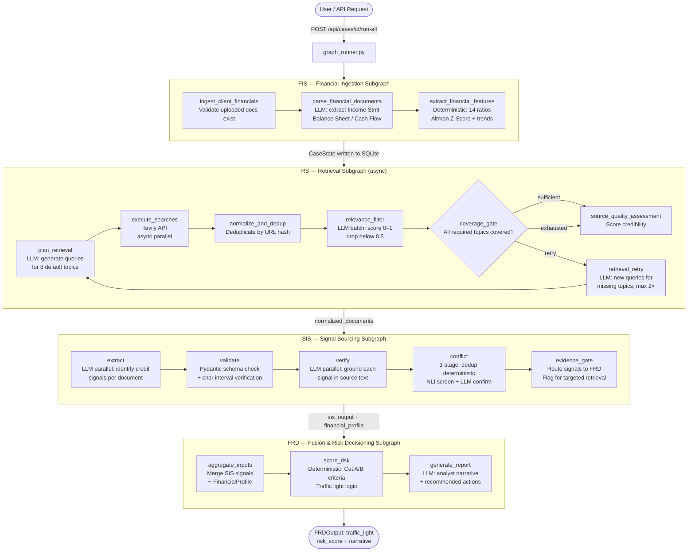
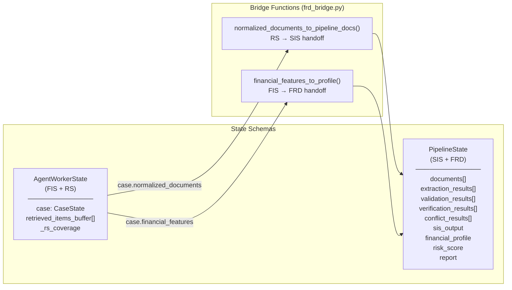

# CREWS — Agentic Workflow Diagram

## Full Pipeline Overview

---

## Detailed Node Map

```mermaid
flowchart TD
    %% ── Entry Points ──────────────────────────────────────────
    API([POST /api/cases/id/run-all\nFull Pipeline]) --> GR
    CLI([CLI: run_pipeline.py\nSIS → FRD only]) --> SIS1

    GR[graph_runner.py\nOrchestrates FIS→RS→SIS→FRD\nSQLite checkpointing]

    %% ── FIS ───────────────────────────────────────────────────
    GR --> FIS1

    FIS1["📂 ingest_client_financials
    • Read case.uploaded_financial_documents
    • Verify file paths
    • Set status = fis_ingestion_complete"]

    FIS2["🔍 parse_financial_documents
    • XML/XBRL deterministic pre-parse
    • LLM extraction (Gemini, 3-retry)
    • Pydantic validation
    • Set status = fis_parsing_complete"]

    FIS3["📊 extract_financial_features
    • Working capital & EBITDA
    • 14 financial ratios
    • Altman Z-Score (3 variants)
    • Industry peer benchmarks
    • Set status = fis_features_extracted"]

    FIS1 --> FIS2 --> FIS3

    FIS3 -->|financial_features → CaseState| DB[(SQLite\nCaseState)]

    %% ── RS ────────────────────────────────────────────────────
    DB -->|read CaseState| RS1

    RS1["🗺️ plan_retrieval
    • LLM generates queries for 8 default topics:
      governance, financials, legal_regulatory,
      market_position, management, controversy,
      competition, environmental
      (LLM may add custom topics, e.g. supply_chain_risk)
    • Creates RetrievalQuery objects"]

    RS2["🌐 execute_searches
    • Async parallel Tavily API calls
    • Writes to retrieved_items_buffer"]

    RS3["🔧 normalize_and_dedup
    • Normalize field names
    • Deduplicate by URL hash
    • Parse dates"]

    RS4["🎯 relevance_filter
    • LLM batch score 0–1 per item
    • Drop items < 0.5 relevance"]

    RS5{{"coverage_gate
    required topics covered?"}}

    RS6["🔄 retrieval_retry
    • LLM: targeted queries for
      missing topics
    • Max 2 retries"]

    RS7["⭐ source_quality_assessment
    • Score by source type, recency
    • Write raw_retrieval_results
    • Build normalized_documents for SIS"]

    RS1 --> RS2 --> RS3 --> RS4 --> RS5
    RS5 -->|"✅ sufficient"| RS7
    RS5 -->|"🔁 retry"| RS6 --> RS1
    RS5 -->|"⚠️ exhausted"| RS7

    RS7 -->|normalized_documents → CaseState| DB

    %% ── SIS ───────────────────────────────────────────────────
    DB -->|read normalized_documents| SIS1

    SIS1["🧠 extract
    • Parallel LLM (ThreadPool, 10 workers)
    • Identify: event_type, event_subtype,
      severity, confidence
    • Char interval evidence anchoring"]

    SIS2["✅ validate
    • Pydantic schema check
    • Char interval verification
    • >30% failures: flag doc for re-extraction
      (max 2×; logged, not re-run yet)"]

    SIS3["🔬 verify
    • Parallel LLM (ThreadPool, 10 workers)
    • yes(×1.0) / partial(×0.5) / no(×0.2)
    • Adjusts confidence via grounding"]

    SIS4["⚖️ conflict
    Stage 1: Cross-doc dedup (deterministic)
    Stage 1.5: Embedding pre-filter (cosine < 0.15 skipped)
    Stage 2: NLI screen (CrossEncoder)
    Stage 3: LLM confirm (parallel)
    → duplicate / contradiction / related / unrelated"]

    SIS5["🚦 evidence_gate
    • Route: frd_direct vs targeted_retrieval
    • Flag high-severity/low-confidence signals
    • Create TargetedRetrievalRequest (logged)
    • Build SISOutput metadata"]

    SIS1 --> SIS2 --> SIS3 --> SIS4 --> SIS5

    %% ── FRD ───────────────────────────────────────────────────
    SIS5 --> FRD1

    FRD1["🔗 aggregate_inputs
    • Merge SIS signals + FinancialProfile
    • Separate signals: Cat A vs Cat B
    • Validate financial data availability"]

    FRD2["🏁 score_risk
    Category A (signal-based):
      A1–A7: risk flags (high/med/low weight)
      A8: mitigating positive signals
    Category B (financial):
      B1: Altman distress zone
      B2: grey zone
      B3: deteriorating trend
      B4: peer anomaly
    ──────────────────────────
    Traffic Light Logic:
    🔴 Red   = ≥2 high-weight OR ≥3 medium
    🟡 Amber = 1 high OR ≥1 medium OR ≥3 low
    🟢 Green = default
    Mitigation (positive avg conf ≥ 0.65):
      Red → Amber if ≤2 high; Amber → Green"]

    FRD3["📝 generate_report
    • LLM narrative (Gemini, temp 0.3)
    • Sections: executive_summary,
      key_risk_findings, financial_health,
      signal_details, disputed_and_ambiguous,
      data_quality_notes, recommended_actions,
      disclaimer (fixed text)
    • Analyst guidance injection"]

    FRD1 --> FRD2 --> FRD3

    FRD3 --> RESULT(["FRDOutput
    traffic_light 🔴🟡🟢
    criteria_results[]
    full_narrative (markdown)
    flags[]"])

    %% ── Styling ───────────────────────────────────────────────
    classDef llm fill:#dbeafe,stroke:#3b82f6,color:#1e3a5f
    classDef det fill:#dcfce7,stroke:#16a34a,color:#14532d
    classDef async fill:#fef9c3,stroke:#ca8a04,color:#713f12
    classDef entry fill:#f3e8ff,stroke:#9333ea,color:#3b0764
    classDef result fill:#fce7f3,stroke:#db2777,color:#831843

    class FIS2,RS1,RS4,RS6,SIS1,SIS3,SIS4,FRD3 llm
    class FIS3,RS3,SIS2,SIS4,FRD2 det
    class RS2,RS3,RS4,RS5,RS6,RS7 async
    class API,CLI entry
    class RESULT result
```

---

## State & Data Flow

---

## Legend

| Color | Meaning |
|-------|---------|
| Blue nodes | LLM call (Gemini via OpenRouter) |
| Green nodes | Deterministic / rule-based |
| Yellow nodes | Async (asyncio / Tavily API) |
| Purple nodes | Entry points |
| Pink nodes | Output / result |
